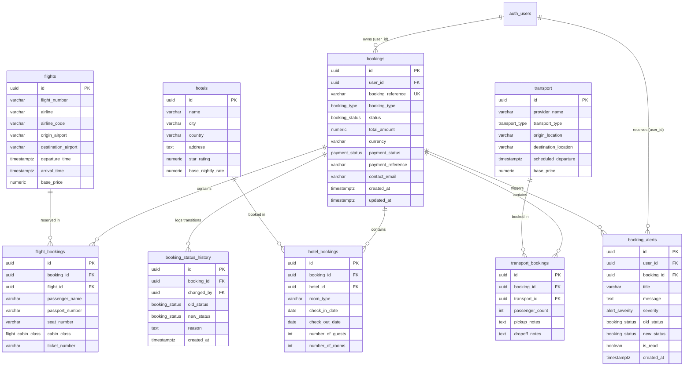

# Database Design Review: Booking Services Domain

| Metadata Field | Specification |
| :--- | :--- |
| **Project** | Voyana — Collaborative Travel Planning Web Application |
| **Jira Issue Key** | **VPM-28** |
| **Issue Title** | **Review Database Design** |
| **Parent Epic** | **VPM-6: Booking Services** |
| **Owner / Assignee** | **Bhavika Sainani (202512053)** — Backend (Booking Services & Payment Integration) |
| **Migration Artifact** | [`supabase/migrations/20260908000000_booking_schema.sql`](file:///d:/DAU%20Sem-3/wsoa/Voyana/supabase/migrations/20260908000000_booking_schema.sql) |
| **Requirements Reference** | Voyana BRD Section 1.6 (`FR-BKG`), Section 1.8 (`FR-PAY`), Use Case `UC-02` |
| **Status** | **Done** / Reviewed & Approved |

---

## 1. Overview & Architecture Goals

The Booking Services database schema is engineered to handle multi-category travel reservations across **flights**, **hotels**, and **ground transport**. The design satisfies five primary engineering requirements:

1. **Strict Referential Integrity**: Prevent orphan bookings and inconsistencies between parent itinerary records, inventory items, and payment transitions.
2. **Table-Per-Type (TPT) Subtype Normalization**: Maximize type safety and query performance while cleanly separating domain-specific booking fields (e.g. flight cabin class vs. hotel room types).
3. **Automated Event-Driven Alerts**: Database-level PostgreSQL triggers that automatically generate customer notification records (`booking_alerts`) upon status transitions (`confirmed`, `delayed`, `cancelled`).
4. **Declarative Multi-Tenant Security (RLS)**: Cryptographic isolation anchored to Supabase `auth.users(id)` ensuring zero data leakage across customers.
5. **Realtime WebSocket Readiness**: Tables published to `supabase_realtime` to enable instantaneous client notifications without polling.

---

## 2. Entity-Relationship Diagram (ERD)



---

## 3. Database Normalization Analysis (1NF to 3NF)

### 3.1 First Normal Form (1NF)
- Every table has a distinct primary key (`id UUID PRIMARY KEY DEFAULT gen_random_uuid()`).
- All attributes contain atomic values (no multi-valued comma-separated lists of passengers or dates).
- Where structured extensibility is needed, an explicit `metadata JSONB` column is provided, but all queryable, validated relational fields are discrete relational columns.

### 3.2 Second Normal Form (2NF)
- All non-key attributes are fully functionally dependent on the entire primary key.
- Subtype junction tables (`flight_bookings`, `hotel_bookings`, `transport_bookings`) have their own synthetic surrogate key `id UUID`, with foreign keys cleanly pointing to `booking_id` and the catalog item (`flight_id`, `hotel_id`, `transport_id`). There are no partial key dependencies.

### 3.3 Third Normal Form (3NF)
- Non-key columns do not depend on other non-key columns (no transitive dependencies).
- Catalog details (e.g. airline name, airport codes, hotel address, transport provider) reside in `flights`, `hotels`, and `transport`. They are referenced by foreign key rather than duplicated in `bookings` or `flight_bookings`.
- Calculated values such as hotel stay duration are computed dynamically or validated via constraints (`CHECK (check_out_date > check_in_date)`).

---

## 4. Design Decisions & Trade-Offs

### 4.1 Subtype Modeling: Table-Per-Type (TPT)
We considered:
1. **Single Table Inheritance (STI)**:
   - *Why rejected*: Storing flight numbers, seat numbers, hotel check-in dates, and vehicle license plates in a single table would result in 60%+ NULL values per row and prevents PostgreSQL constraints like `NOT NULL` on flight passport numbers or hotel date bounds.
2. **JSONB Document Approach**:
   - *Why rejected*: Storing booking details inside `bookings.payload JSONB` avoids schema migrations, but makes reporting, indexing, foreign key enforcement, and payment reconciliation prone to silent schema drift and query degradation.
3. **Table-Per-Type (TPT)** (Chosen):
   - Combines a uniform parent `bookings` table for payment, status, and user ownership with dedicated child tables for domain semantics.
   - Allows clean polymorphism: an itinerary can bundle a flight and a hotel under the exact same `booking_reference`.

### 4.2 Status Transition & Audit Trail
- To prevent silent status overrides, every transition on `bookings.status` triggers an automatic entry in `booking_status_history`.
- This ensures an immutable, auditable log of who changed the status, when it changed, and why (e.g., flight delayed due to weather, customer requested cancellation, Stripe payment confirmed).

---

## 5. Automated Alert Generation (Postgres Trigger Pipeline)

A core requirement of `VPM-93` is notifying travelers when their booking status changes. Rather than relying on unreliable client-side calls or external cron jobs:
1. The PostgreSQL trigger `trg_booking_status_change` fires `AFTER UPDATE OF status ON public.bookings`.
2. The trigger checks `IF OLD.status IS DISTINCT FROM NEW.status`.
3. It automatically inserts a formatted record into `public.booking_alerts` with:
   - Contextual title and message tailored to the new status.
   - Appropriate severity:
     - `confirmed` $\rightarrow$ `success` (e.g. "Booking Confirmed: tickets issued")
     - `delayed` $\rightarrow$ `warning` (e.g. "Schedule Update: your flight is delayed")
     - `cancelled` $\rightarrow$ `critical` (e.g. "Booking Cancelled: refund initiated")
     - `completed` $\rightarrow$ `info`
4. Because `public.booking_alerts` is part of `supabase_realtime`, the Supabase Realtime daemon broadcasts this record via WebSocket to any active browser session matching the user's ID.

---

## 6. Security Model & Row Level Security (RLS)

All tables have RLS explicitly enabled:
- **`bookings`**:
  - `SELECT`, `INSERT`, `UPDATE` strictly restricted to `auth.uid() = user_id`.
- **`flight_bookings`, `hotel_bookings`, `transport_bookings`**:
  - Protected via `EXISTS` subqueries checking that the linked parent `booking_id` belongs to `auth.uid()`.
- **`booking_alerts`**:
  - Users can read and update their own notifications (`is_read = true`).
  - Cross-user alert viewing is prevented at the database engine level.
- **Inventory Catalogs (`flights`, `hotels`, `transport`)**:
  - Read-accessible (`SELECT`) to all authenticated and public visitors for search and discovery.
  - Write/Update restricted to administrative service roles.

---

## 7. Indexing Strategy

B-Tree indexes are applied to all high-frequency query paths:
- `idx_bookings_user_id`: Fast dashboard retrieval of a user's reservations.
- `idx_bookings_status`: Rapid filtering for operational reports and status reconciliation.
- `idx_bookings_reference`: Unique lookups when users enter their reference in search or customer support.
- `idx_booking_alerts_unread`: Partial index (`WHERE is_read = FALSE`) on `(user_id, is_read)` to make unread notification count badge queries instantaneous ($O(1)$ lookup).
- Foreign key indexes across all child reservation tables to prevent full-table scans during relational joins.

---

## 8. Schema Migration Verification

To execute and verify this migration on a live Supabase project:
```bash
# Apply migration
supabase db push

# Or execute directly via psql / Supabase Dashboard SQL Editor
psql -f supabase/migrations/20260908000000_booking_schema.sql
```
Verification queries and automated test procedures are documented in [`docs/manual_testing_guide.md`](file:///d:/DAU%20Sem-3/wsoa/Voyana/docs/manual_testing_guide.md).
