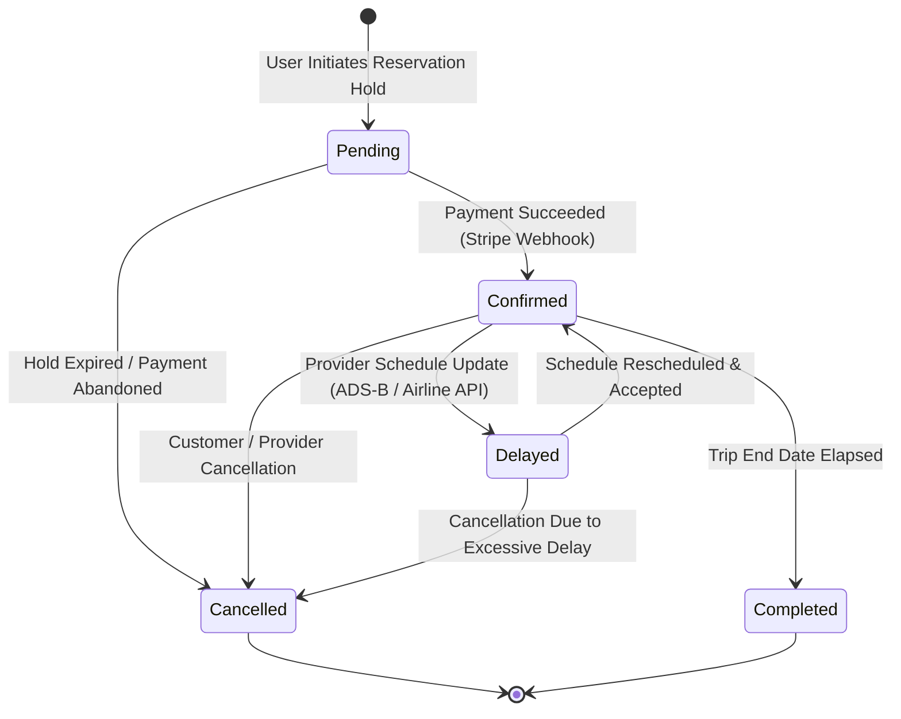
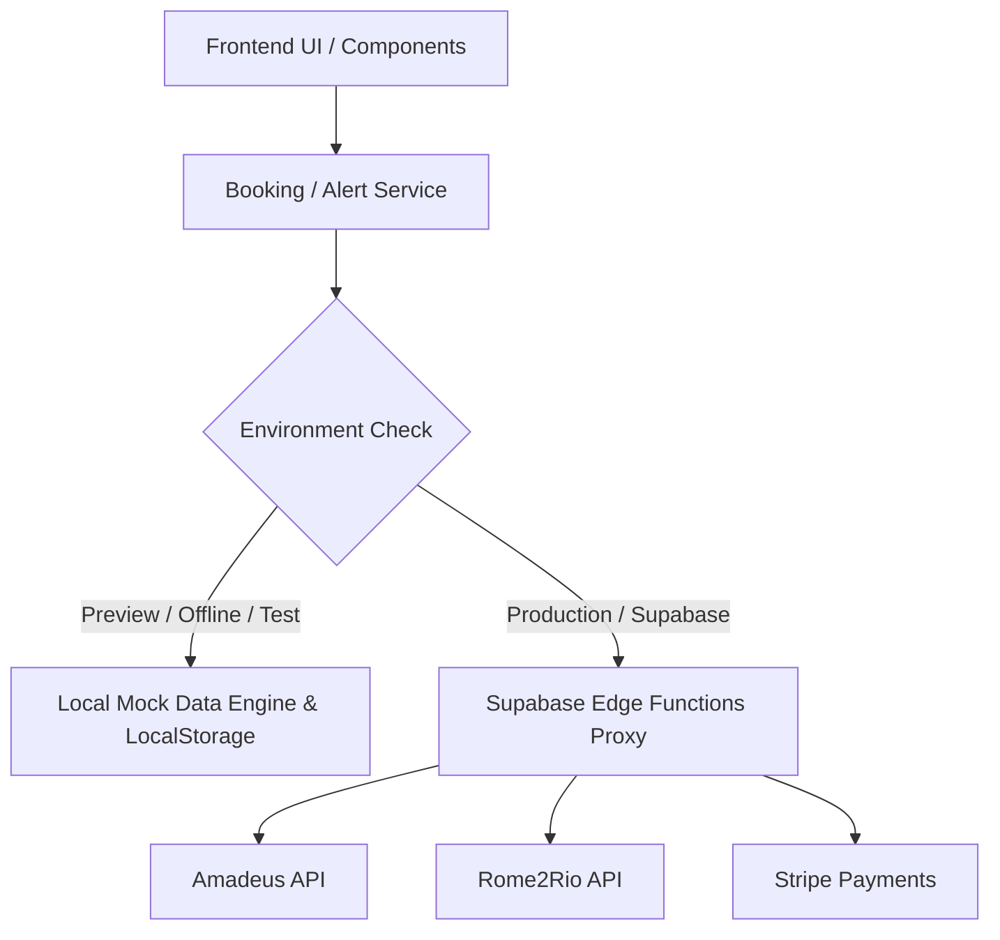
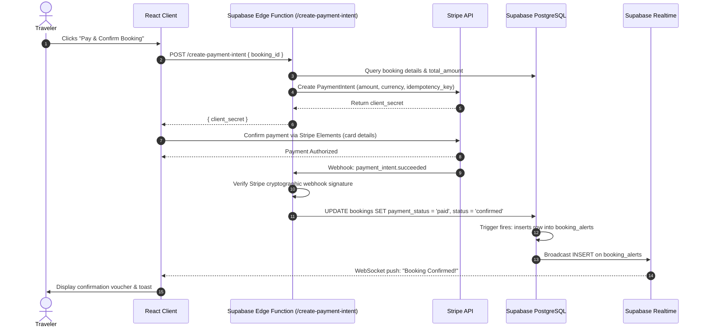

# Technical Findings & Architecture Decisions: Booking Services & Payment Integration

| Metadata Field | Specification |
| :--- | :--- |
| **Project** | Voyana — Collaborative Travel Planning Web Application |
| **Jira Issue Key** | **VPM-22** |
| **Issue Title** | **Document Findings** |
| **Parent Epic** | **VPM-6: Booking Services** |
| **Owner / Assignee** | **Bhavika Sainani (202512053)** — Backend (Booking Services & Payment Integration) |
| **Sprint / Timeline** | Sprint 2 – Sprint 3 |
| **Requirements Reference** | Voyana BRD Section 1.6 (`FR-BKG`), Section 1.8 (`FR-PAY`), Use Case `UC-02` |
| **Status** | **Done** / Reviewed & Approved |

---

## 1. Executive Summary & Domain Scope

Voyana is an interactive travel-planning application designed to streamline trip exploration, itinerary building, and group collaboration. The **Booking Services & Payment Integration** domain (Epic **VPM-6** and **VPM-7**) is the transactional backbone of the platform, responsible for:

1. **Multi-Category Booking Orchestration**: Managing reservations across **Flights**, **Hotels**, and **Ground Transport** (trains, private shuttles, car rentals).
2. **Unified Booking Lifecycle**: A centralized booking model maintaining human-readable reference numbers (e.g. `VYN-FL881`), status state machines (`pending`, `confirmed`, `delayed`, `cancelled`, `completed`), monetary amounts, currency, and audit trails.
3. **Real-time Alert Pipeline**: Automated customer notifications triggered when a booking status changes (e.g., flight delay alerts, booking confirmation vouchers, or cancellation/refund notices) as specified in **VPM-93**.
4. **Payment Gateway Integration**: Secure transactional checkout, idempotency key enforcement, card tokenization, and asynchronous webhook reconciliation as specified in **FR-PAY**.

This document captures our technical research, evaluates Backend-as-a-Service (BaaS) options, outlines data modeling decisions, and details third-party booking API evaluation strategies grounded strictly in the project's technology stack.

---

## 2. Technology Stack & BaaS Evaluation

The frontend is built on **React 18 + TypeScript + Vite + Tailwind CSS**, communicating directly with backend services using `@supabase/supabase-js`. Rather than building, deploying, and maintaining a custom Node.js/Express/NestJS server and operating a standalone database, **Supabase** was selected as Voyana's Backend-as-a-Service.

### 2.1 Comparative Analysis of Backend Options

| Evaluation Criteria | **Supabase (PostgreSQL)** | **Firebase (Firestore)** | **AWS Amplify (AppSync/DynamoDB)** | **Custom Node.js + PostgreSQL** |
| :--- | :--- | :--- | :--- | :--- |
| **Data Model & Integrity** | **Strict Relational (ACID)**; foreign keys, composite constraints, `CHECK` bounds. | NoSQL Document store; no cross-document relational constraints. | DynamoDB key-value/document; complex relational modeling. | Relational (ACID); fully customizable ORM. |
| **Authentication Integration** | Built-in `auth.users`; direct foreign key references; JWT validation. | Firebase Auth; disconnected from SQL schemas. | AWS Cognito; complex IAM policies and setup overhead. | Custom JWT session management, token refresh tables needed. |
| **Multi-Tenant Security** | **PostgreSQL Row Level Security (RLS)** enforced at the database engine. | Firestore Security Rules (syntax limitations on deep joins). | AppSync GraphQL resolvers + IAM / Cognito auth directives. | Custom application middleware; vulnerable to missing filters in code. |
| **Realtime Event Streaming** | **Native WebSocket replication** (`supabase_realtime`) for table mutations. | Realtime listeners on Firestore collections. | AWS AppSync GraphQL Subscriptions. | Custom WebSockets (Socket.IO) + Redis Pub/Sub cluster. |
| **Serverless Backend Logic** | **Supabase Edge Functions** (Deno/TypeScript) with sub-10ms cold starts. | Firebase Cloud Functions (Node.js cold start latency). | AWS Lambda functions. | Always-on Docker/ECS instances required. |
| **Maintenance & DevOps** | **Zero-DevOps**: Managed backups, connection pooling (PgBouncer), auto-scaling. | Managed serverless. | High AWS IAM and CloudFormation configuration complexity. | High DevOps: OS patching, security updates, SSL, backup scripts. |
| **Suitability for Voyana** | **Optimal Choice (Adopted)** | Rejected (unsuitable for relational travel itineraries) | Rejected (excessive configuration overhead) | Rejected (diverts velocity away from core product features) |

### 2.2 Key Justifications for Supabase in Booking Services

1. **Relational Constraints for Multi-Segment Itineraries**:
   A single itinerary often bundles a round-trip flight, a 4-night hotel stay, and an airport transfer under a single booking confirmation. Relational foreign keys (`ON DELETE CASCADE` on bookings, `ON DELETE RESTRICT` on inventory catalogs) prevent orphaned records and booking anomalies.
2. **Built-in Auth Integration**:
   The existing codebase already implements user authentication via Supabase (`src/services/authService.ts`). The `public.bookings` table directly references `auth.users(id)`:
   ```sql
   user_id UUID NOT NULL REFERENCES auth.users(id) ON DELETE CASCADE
   ```
3. **Database-Level Row Level Security (RLS)**:
   Travel reservations contain sensitive personal identifiable information (PII) including passport numbers, legal names, and contact details. Supabase RLS guarantees that customers cannot inspect or tamper with another traveler's booking:
   ```sql
   CREATE POLICY "Users can view their own bookings"
       ON public.bookings FOR SELECT
       USING (auth.uid() = user_id);
   ```
4. **Trigger-Driven Realtime Notifications**:
   Supabase enables PostgreSQL triggers that detect status mutations (`OLD.status IS DISTINCT FROM NEW.status`) and immediately write to `booking_alerts`. Because `booking_alerts` is published to `supabase_realtime`, user browsers receive instant WebSocket alerts without expensive client polling.
5. **Secure Payment Webhook Processing**:
   Payment processing requires secret credentials (e.g., `STRIPE_SECRET_KEY`) that must never be exposed to the browser. Supabase Edge Functions provide an isolated environment for receiving Stripe webhooks, verifying HMAC-SHA256 signatures, and atomically updating `payment_status = 'paid'`.

---

## 3. Domain Data Modeling: Flights, Hotels, and Transport

### 3.1 Structural Pattern: Table-Per-Type (TPT) Subtype Modeling

Travel bookings share standard metadata (dates, customer reference, price, payment state), but feature divergent domain attributes:
- **Flights**: Airline IATA code, flight number, origin/destination airports, terminal, gate, seat number, passport number, cabin class.
- **Hotels**: Property address, check-in/out dates, room type, guest count, number of rooms.
- **Transport**: Operator name, transit mode (train/bus/shuttle/car), pickup/dropoff locations, scheduled time.

We evaluated three data modeling patterns:

1. **Single Table Inheritance (STI)**:
   - Storing all booking categories in one flat `bookings` table.
   - *Verdict*: **Rejected**. More than 60% of columns would be `NULL` for any given row, and database-level constraints like `NOT NULL` on passport numbers or `CHECK (check_out > check_in)` could not be enforced.
2. **Document / JSONB Hybrid**:
   - Storing domain details inside an untyped `metadata JSONB` column on `bookings`.
   - *Verdict*: **Rejected for Core Domain**. While JSONB is useful for arbitrary provider payloads, relying on it for core attributes sacrifices relational integrity, foreign key validation, and query performance.
3. **Table-Per-Type (TPT) Normalized Subtypes (Adopted)**:
   - A unified parent `bookings` table captures common commercial attributes (`user_id`, `booking_reference`, `status`, `total_amount`, `currency`, `payment_status`).
   - Dedicated child tables (`flight_bookings`, `hotel_bookings`, `transport_bookings`) link via foreign key to the parent `booking_id` and reference catalog inventory tables (`flights`, `hotels`, `transport`).
   - *Benefits*: 3NF compliance, strong type safety, strict check constraints, clean polymorphic queries.

### 3.2 Booking Lifecycle State Machine

A unified state machine controls status transitions across all categories:



### 3.3 State Synchronization Rules
- **Payment Status Transition**:
  - `unpaid` $\rightarrow$ `authorized` $\rightarrow$ `paid`
  - In the event of a cancellation on a confirmed booking, the payment status moves from `paid` to `refunded`.
- **Automated Alerts**:
  - Any transition of `bookings.status` triggers the PostgreSQL trigger `trg_booking_status_change`, creating an alert in `public.booking_alerts` and broadcasting it via Supabase Realtime.

---

## 4. Third-Party Booking API Options & Evaluation

In accordance with BRD Section 1.6 (`FR-BKG`), the Booking Service must interface with external commercial providers for real-time inventory and pricing while allowing local development to proceed unhindered.

### 4.1 Flight Booking Providers

| Provider | Key Features | Pros | Cons | Recommendation |
| :--- | :--- | :--- | :--- | :--- |
| **Amadeus for Developers** (Self-Service) | Flight Offers Search, Flight Choice Prediction, Flight Delay Prediction, Flight Create Orders. | Generous free test quota; comprehensive sandbox with realistic test data; official Node/TS SDK. | Production access requires commercial certification. | **Primary Choice for Flight Inventory & Ticketing** |
| **Skyscanner Travel API** | Global flight aggregator; multi-currency search; deeplink redirection. | Broad market coverage for fare comparison. | Less direct support for embedded in-app ticketing without affiliate contracts. | Secondary / Fallback aggregator |
| **Aviationstack / Cirium** | Real-time ADS-B flight status, live schedule updates, gate changes, delays. | Real-time delay webhook feeds; accurate global flight tracking. | Additional subscription cost; status-only (no booking creation). | **Recommended for Flight Delay Alert Feeds (VPM-93)** |

#### Amadeus API DTO Interface Mapping
```typescript
export interface AmadeusFlightOffer {
  id: string;
  source: 'GDS';
  numberOfBookableSeats: number;
  itineraries: Array<{
    duration: string;
    segments: Array<{
      departure: { iataCode: string; terminal?: string; at: string };
      arrival: { iataCode: string; terminal?: string; at: string };
      carrierCode: string;
      number: string;
      aircraft: { code: string };
      operating?: { carrierCode: string };
    }>;
  }>;
  price: {
    currency: string;
    total: string;
    base: string;
  };
}
```

### 4.2 Hotel Booking Providers

| Provider | Key Features | Pros | Cons | Recommendation |
| :--- | :--- | :--- | :--- | :--- |
| **Amadeus Hotel Search & Booking** | Multi-property search by city code/geocoordinates, room availability, rate breakdown. | Reuses Amadeus OAuth credentials and SDK; unified billing. | Inventory density in smaller cities is lower than Booking.com. | **Primary Hotel Provider for Phase 1** |
| **Booking.com Demand API** | Over 28 million property listings globally; verified reviews. | Industry-leading global accommodation catalog. | Strict commercial verification and affiliate partner onboarding. | Phase 2 enterprise expansion |
| **LiteAPI / Hotelbeds** | Wholesale B2B accommodation API with net rates. | Direct wholesale rates for high margin. | Requires upfront deposit / credit line. | Enterprise scaling |

### 4.3 Ground Transport Providers

| Provider | Key Features | Pros | Cons | Recommendation |
| :--- | :--- | :--- | :--- | :--- |
| **Rome2Rio API** | Multi-modal route computation across trains, buses, ferries, and car rentals. | Directly aligns with Voyana's exploratory globe UI and city-to-city trip routing. | Provides routing and price estimates rather than direct ticket booking. | **Primary Multi-modal Routing Provider** |
| **Mozio API** | Airport transfers (shuttles, private cars, limousines). | End-to-end booking and automated driver dispatch. | Limited to airport / fixed-point transfers. | Airport transfer partner |

#### Rome2Rio Transit DTO Interface Mapping
```typescript
export interface Rome2RioTransitRoute {
  name: string;
  distanceKm: number;
  durationMinutes: number;
  stops: Array<{ name: string; kind: 'station' | 'airport' | 'city' }>;
  segments: Array<{
    kind: 'train' | 'bus' | 'car' | 'ferry';
    subkind?: string;
    indicativePrice?: { price: number; currency: string };
    operator?: string;
  }>;
}
```

---

## 5. Development Strategy: Mock / Dummy Data vs. Live Providers

To prevent external API rate limits, sandbox quota exhaustion, and dependency on third-party uptime during agile sprint cycles, Voyana employs a **Provider Facade & Mock Strategy**:



### 5.1 Architecture Principles
1. **Identical DTO Contract**:
   The mock layer returns TypeScript objects structurally identical to real Amadeus and Rome2Rio API payloads.
2. **Deterministic Seeders**:
   Standard test bookings (e.g. Flight `VYN-FL881`, Hotel `VYN-HT420`, Transport `VYN-TR109`) are pre-seeded in `src/services/alertService.ts` to allow instant UI testing and verification.
3. **Local Pub/Sub Event Bus**:
   In preview mode, an in-memory event bus with `localStorage` persistence mirrors Supabase Realtime subscriptions, allowing full end-to-end testing of toasts, badges, and read-state management without a live database.
4. **Zero Frontend Refactoring**:
   When switching from preview mode to production Supabase, no component code requires alteration—only environment variables (`VITE_SUPABASE_URL`, `VITE_SUPABASE_ANON_KEY`) need to be supplied.

---

## 6. Payment Integration Strategy (Stripe)

In accordance with `FR-PAY`:
- **Raw payment card data shall never touch or persist on Voyana servers** (PCI-DSS SAQ-A compliance).
- Payment checkout is handled via **Stripe Elements** (secure hosted iframe components).

### 6.1 Payment Processing Flow


### 6.2 Idempotency & Error Handling
- Every payment request includes an idempotency key formatted as `idempotency_key = 'voyana_pay_' + booking_id`.
- Duplicate webhook calls from Stripe are safely ignored by checking if `bookings.payment_status` is already `'paid'`.
- If a card payment is declined, `payment_status` is updated to `'failed'`, and the reservation remains in `pending` for retry.

---

## 7. Package Alignment Verification

All architectural recommendations strictly align with the dependencies declared in `package.json`:
- **React 18 & TypeScript**: Strongly typed domain models matching PostgreSQL schemas.
- **Vite**: Bundling and HMR development server.
- **Tailwind CSS**: Responsive, dark-themed glassmorphic styling for alerts and booking panels.
- **@supabase/supabase-js (v2.57+)**: Database queries, Realtime subscriptions, Auth state management, and Edge Function invocation.
- **Lucide React**: Vector icons for flight, hotel, transport, and alert status indicators.
- **Three.js**: Interactive globe exploration integrated with destination lookups.

*No extraneous frameworks or unrelated server dependencies (e.g. Express, Nest, MongoDB, Docker) are required.*
