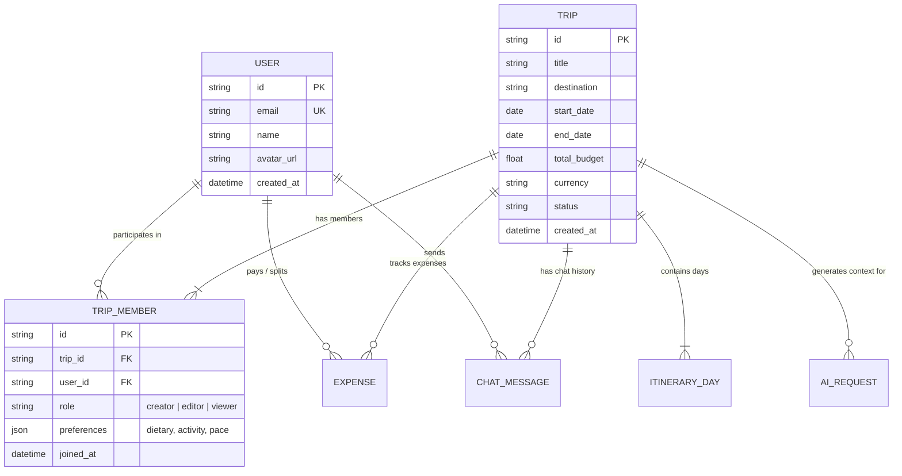
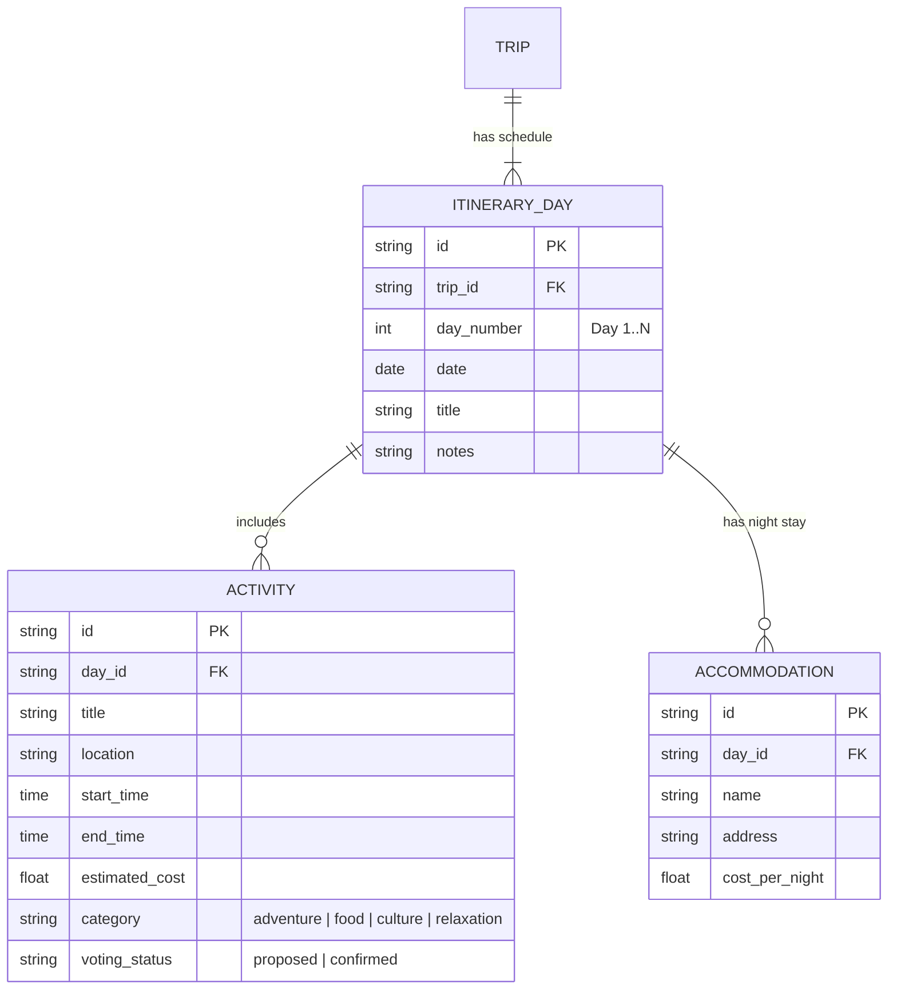
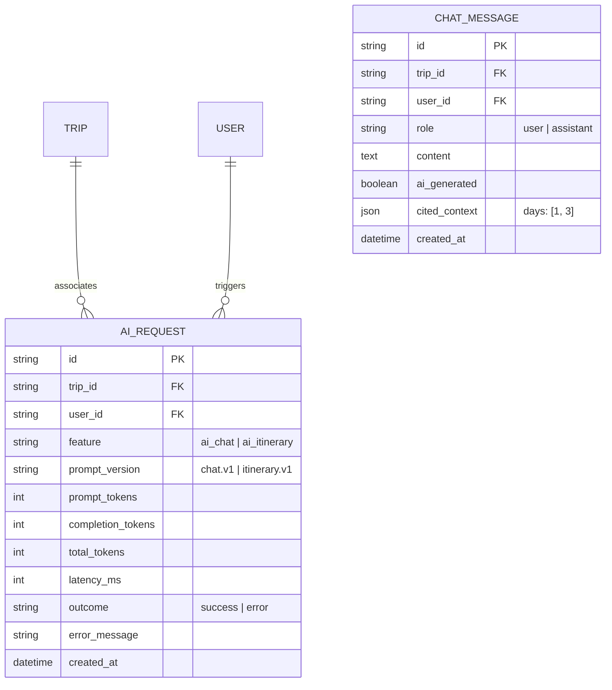

# Voyana Database ER Diagrams (VPM-26)

This document contains the Entity-Relationship (ER) models for the Voyana collaborative travel platform.

## 1. Core Domain ER Model (Users, Trips, Collaboration)

## 2. Itinerary & Activities Model

## 3. AI Service Telemetry & Chat Model

