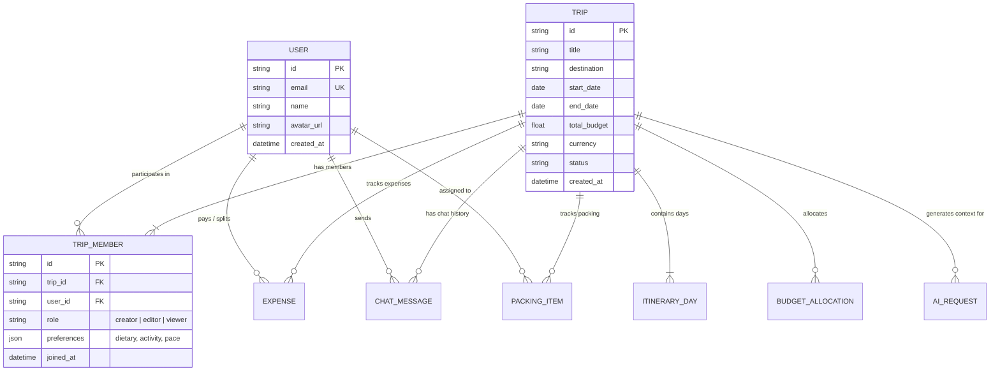
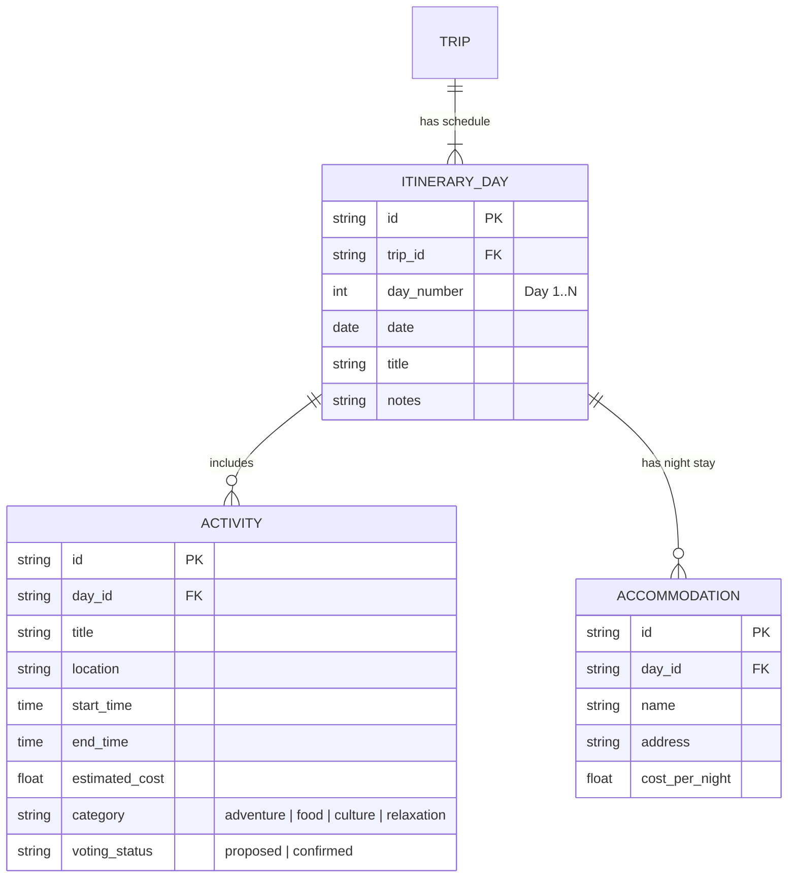
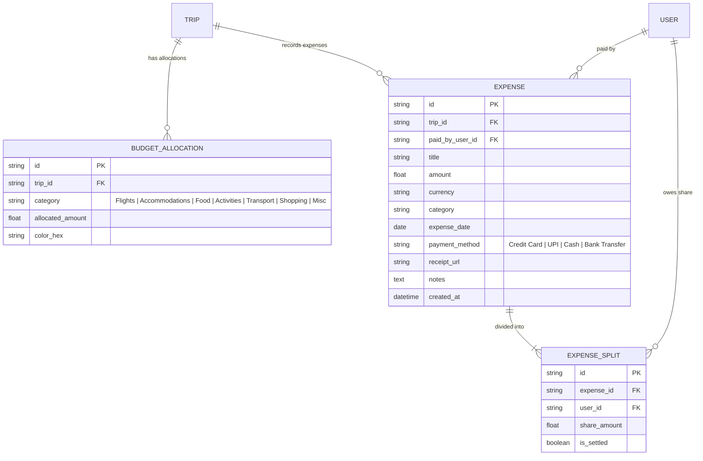
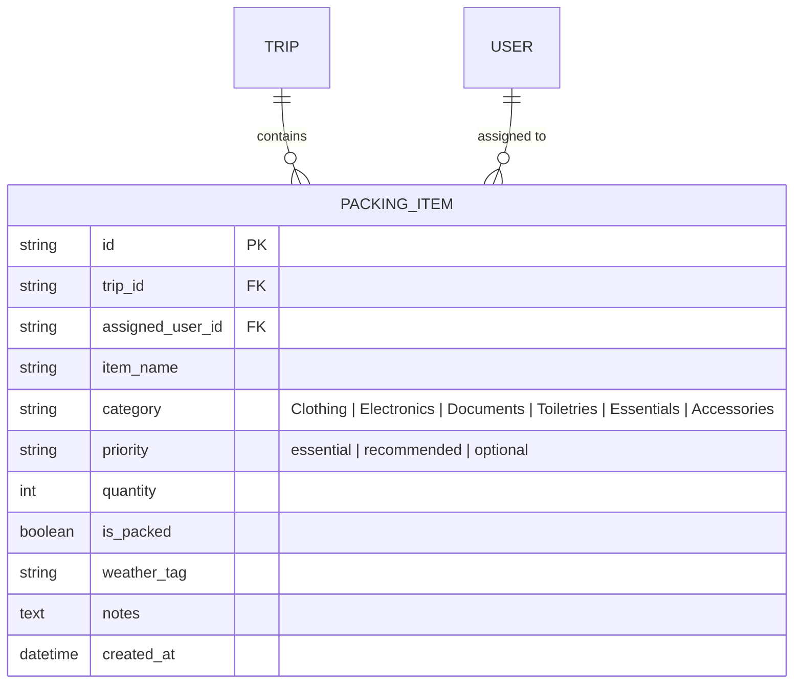
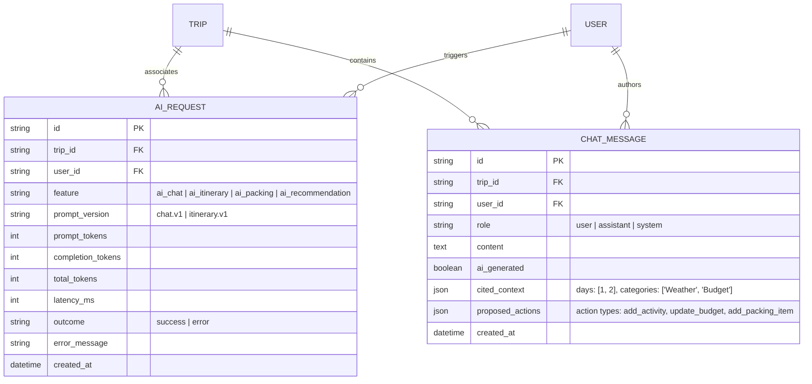

# Voyana Database ER Diagrams (VPM-26)

This document contains the Entity-Relationship (ER) models for the Voyana collaborative travel platform.

| Metadata Field | Specification |
| :--- | :--- |
| **Project** | Voyana — Collaborative AI Travel Planning & Booking Platform |
| **Jira Issue Key** | **VPM-26** |
| **Issue Title** | **Design ER Diagram & Database Architecture** |
| **Parent Epic** | **VPM-1: Core Architecture & Database Models** |
| **Assignee** | **202512079** (Jagrat Kumar) |
| **Reporter** | **Diya Shah** |
| **Status** | **Done** |
| **Updated Date** | **Aug 20, 2026, 4:32 PM** |

---

## 1. Core Domain ER Model (Users, Trips, Collaboration)

```mermaid
erDiagram
    USER ||--o{ TRIP_MEMBER : "participates in"
    USER ||--o{ EXPENSE : "pays / splits"
    USER ||--o{ CHAT_MESSAGE : "sends"
    USER ||--o{ PACKING_ITEM : "assigned to"
    
    TRIP ||--|{ TRIP_MEMBER : "has members"
    TRIP ||--|{ ITINERARY_DAY : "contains days"
    TRIP ||--o{ EXPENSE : "tracks expenses"
    TRIP ||--o{ BUDGET_ALLOCATION : "allocates"
    TRIP ||--o{ PACKING_ITEM : "tracks packing"
    TRIP ||--o{ CHAT_MESSAGE : "has chat history"
    TRIP ||--o{ AI_REQUEST : "generates context for"

    USER {
        string id PK
        string email UK
        string name
        string avatar_url
        datetime created_at
    }

    TRIP {
        string id PK
        string title
        string destination
        date start_date
        date end_date
        float total_budget
        string currency
        string status
        datetime created_at
    }

    TRIP_MEMBER {
        string id PK
        string trip_id FK
        string user_id FK
        string role "creator | editor | viewer"
        json preferences "dietary, activity, pace"
        datetime joined_at
    }
```

---

## 2. Itinerary & Activities Model

```mermaid
erDiagram
    TRIP ||--|{ ITINERARY_DAY : "has schedule"
    ITINERARY_DAY ||--o{ ACTIVITY : "includes"
    ITINERARY_DAY ||--o{ ACCOMMODATION : "has night stay"

    ITINERARY_DAY {
        string id PK
        string trip_id FK
        int day_number "Day 1..N"
        date date
        string title
        string notes
    }

    ACTIVITY {
        string id PK
        string day_id FK
        string title
        string location
        time start_time
        time end_time
        float estimated_cost
        string category "adventure | food | culture | relaxation"
        string voting_status "proposed | confirmed"
    }

    ACCOMMODATION {
        string id PK
        string day_id FK
        string name
        string address
        float cost_per_night
    }
```

---

## 3. Budget, Category Allocations & Transaction Ledger Model (VPM-41, VPM-67, VPM-78)

```mermaid
erDiagram
    TRIP ||--o{ BUDGET_ALLOCATION : "has allocations"
    TRIP ||--o{ EXPENSE : "records expenses"
    EXPENSE ||--|{ EXPENSE_SPLIT : "divided into"
    USER ||--o{ EXPENSE : "paid by"
    USER ||--o{ EXPENSE_SPLIT : "owes share"

    BUDGET_ALLOCATION {
        string id PK
        string trip_id FK
        string category "Flights | Accommodations | Food | Activities | Transport | Shopping | Misc"
        float allocated_amount
        string color_hex
    }

    EXPENSE {
        string id PK
        string trip_id FK
        string paid_by_user_id FK
        string title
        float amount
        string currency
        string category
        date expense_date
        string payment_method "Credit Card | UPI | Cash | Bank Transfer"
        string receipt_url
        text notes
        datetime created_at
    }

    EXPENSE_SPLIT {
        string id PK
        string expense_id FK
        string user_id FK
        float share_amount
        boolean is_settled
    }
```

---

## 4. Smart Packing Checklist & Task Assignment Model (VPM-42, VPM-191)

```mermaid
erDiagram
    TRIP ||--o{ PACKING_ITEM : "contains"
    USER ||--o{ PACKING_ITEM : "assigned to"

    PACKING_ITEM {
        string id PK
        string trip_id FK
        string assigned_user_id FK
        string item_name
        string category "Clothing | Electronics | Documents | Toiletries | Essentials | Accessories"
        string priority "essential | recommended | optional"
        int quantity
        boolean is_packed
        string weather_tag
        text notes
        datetime created_at
    }
```

---

## 5. AI Service Telemetry & Chat Model (VPM-5, VPM-38, VPM-44, VPM-46, VPM-49)

```mermaid
erDiagram
    TRIP ||--o{ AI_REQUEST : "associates"
    USER ||--o{ AI_REQUEST : "triggers"
    TRIP ||--o{ CHAT_MESSAGE : "contains"
    USER ||--o{ CHAT_MESSAGE : "authors"

    AI_REQUEST {
        string id PK
        string trip_id FK
        string user_id FK
        string feature "ai_chat | ai_itinerary | ai_packing | ai_recommendation"
        string prompt_version "chat.v1 | itinerary.v1"
        int prompt_tokens
        int completion_tokens
        int total_tokens
        int latency_ms
        string outcome "success | error"
        string error_message
        datetime created_at
    }

    CHAT_MESSAGE {
        string id PK
        string trip_id FK
        string user_id FK
        string role "user | assistant | system"
        text content
        boolean ai_generated
        json cited_context "days: [1, 2], categories: ['Weather', 'Budget']"
        json proposed_actions "action types: add_activity, update_budget, add_packing_item"
        datetime created_at
    }
```
